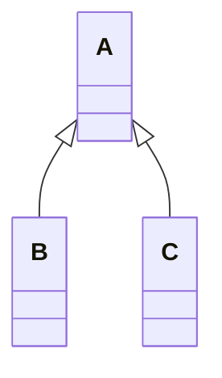
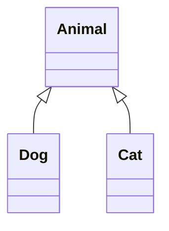
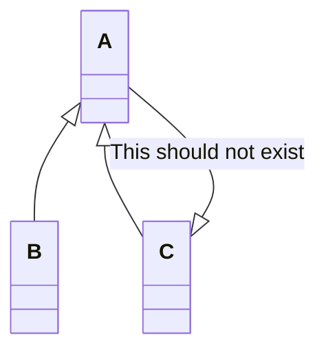

# python_circular_import
This is an exmaple of circular import in python

## Correct imports

```mermaid
classDiagram
A <|-- B
A <|-- C
```

```mermaid
classDiagram
Animal <|-- Dog
Animal <|-- Cat
```

## Circular import (Wrong)

```mermaid
classDiagram
A <|-- B
A <|-- C
C <|-- A: This should not exist
```